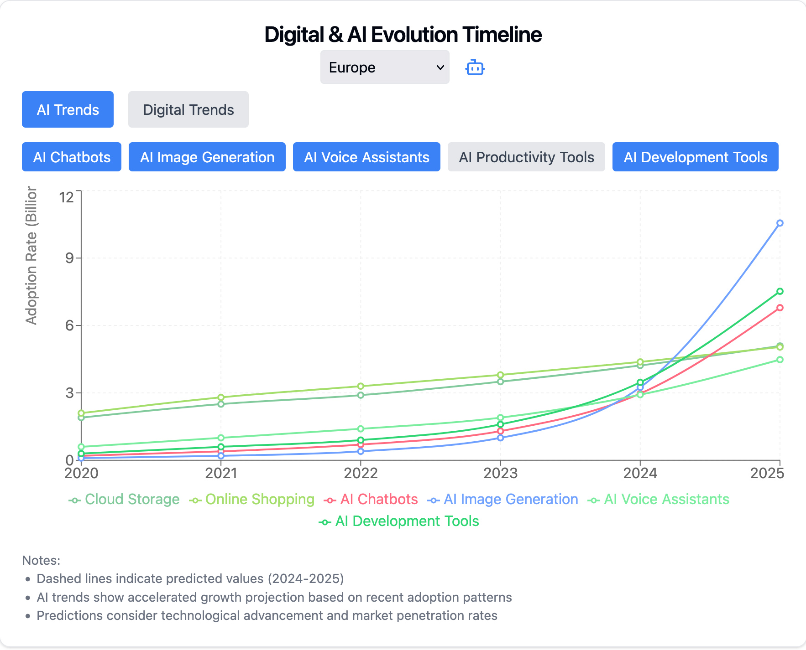
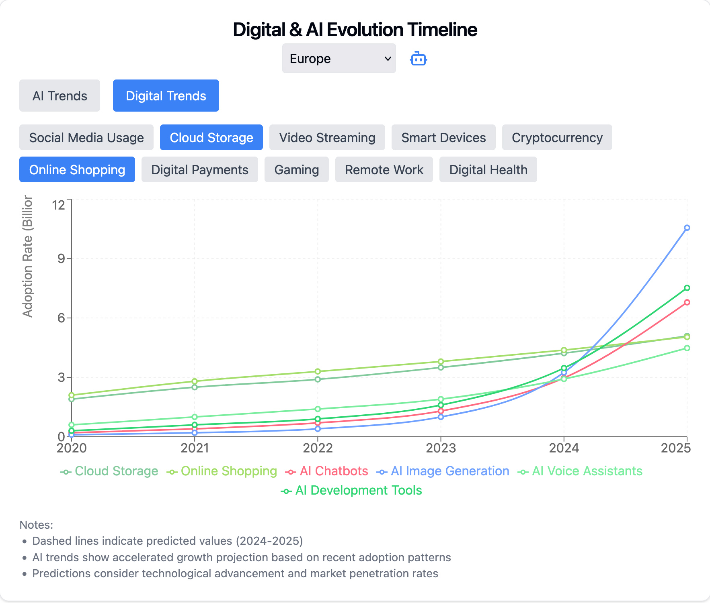

# Digital Time Capsule

## Overview
The **Digital Time Capsule** is a React-based visualization tool that showcases the evolution and adoption of digital and AI technologies over time.

---

## Features
1. **Interactive Line Chart**:
   - Displays historical and predicted data for digital and AI technology adoption.
   - Users can toggle between categories to customize the displayed data.

2. **Category Selection**:
   - Filter by **AI** or **Digital** trends.
   - Toggle individual categories to focus on specific areas of interest.

---

## Screenshots

### 1. AI Trends
This view highlights **AI Trends**, allowing users to explore categories such as AI Chatbots, AI Image Generation, and more.



### 2. Digital Trends
This view focuses on **Digital Trends**, displaying categories like Social Media, Cloud Storage, and Online Shopping.



---

## Setup Instructions

### Prerequisites
- **Node.js** (>=14.x)
- **npm** or **yarn**

### Installation
1. Clone the repository:
   ```bash
   git clone https://github.com/makalin/Digital-Time-Capsule.git
   cd Digital-Time-Capsule
   ```
2. Install dependencies:
   ```bash
   npm install
   ```
   or
   ```bash
   yarn
   ```

### Running the Application
1. Start the development server:
   ```bash
   npm run dev
   ```
   or
   ```bash
   yarn dev
   ```
2. Open your browser and navigate to `http://localhost:3000`.

---

## Usage
1. Select a region (North America or Europe) from the dropdown.
2. Toggle between **AI Trends** and **Digital Trends** using the switch buttons.
3. Use the buttons to add or remove categories from the chart.
4. Hover over the chart to view detailed information for each data point.

---

## Tech Stack
- **React**
- **Recharts**
- **Tailwind CSS**
- **JavaScript (ES6+)**
- **Lucide Icons**

---

## License
This project is licensed under the MIT License.

---

## Contributing
Contributions are welcome! Please open an issue or submit a pull request.
